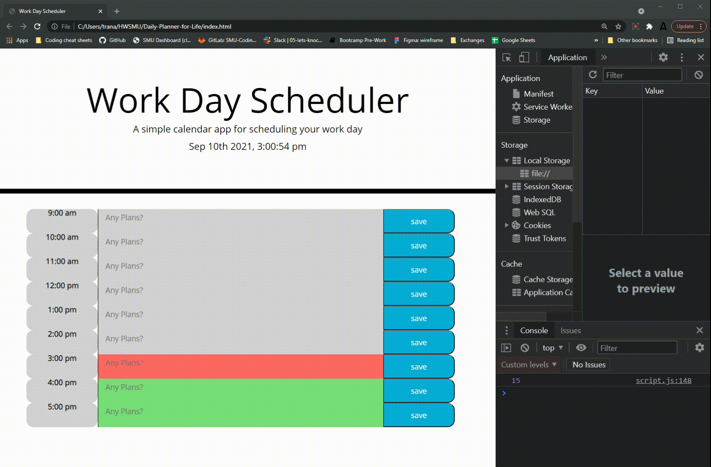

# Daily-Planner-for-Life

**Version 1.0**

Daily Planner For Life

## Note 
You are important.

## Installation Instructions
No installation necessary. 
1) Click on live page.
2) Select time you have plans.
3) Insert Plans.
4) Save plans.
4) Success!

## Acceptance Criteria
Students have completed this project when:

GIVEN I am using a daily planner to create a schedule

*WHEN I open the planner
THEN the current day is displayed at the top of the calendar
*WHEN I scroll down
THEN I am presented with timeblocks for standard business hours
*WHEN I view the timeblocks for that day
THEN each timeblock is color coded to indicate whether it is in the past, present, or future
*WHEN I click into a timeblock
THEN I can enter an event
*WHEN I click the save button for that timeblock
THEN the text for that event is saved in local storage
*WHEN I refresh the page
THEN the saved events persist

## Screenshot

## Links
* [Deployed Website Link](https://andrewt11.github.io/Daily-Planner-for-Life/)
* [Code Repository Link](https://github.com/AndrewT11/Daily-Planner-for-Life)

## Credits
Andrew Tran
Levi Halvorson
Matthew Daniels
Mengmei Tu

### Resources

* https://www.w3schools.com/
* https://developer.mozilla.org/en-US/
* https://choosealicense.com/
* https://cloudconvert.com/webm-to-gif
* https://www.github.com
* https://www.youtube.com/watch?v=rVyTjFofok0&t=539s
* https://www.youtube.com/watch?v=k8yJCeuP6I8
* https://www.youtube.com/watch?v=rVyTjFofok0

### License
Copyright (c) [2021] [Andrew Tran]

Permission is hereby granted, free of charge, to any person obtaining a copy
of this software and associated documentation files (the "Software"), to deal
in the Software without restriction, including without limitation the rights
to use, copy, modify, merge, publish, distribute, sublicense, and/or sell
copies of the Software, and to permit persons to whom the Software is
furnished to do so, subject to the following conditions:

The above copyright notice and this permission notice shall be included in all
copies or substantial portions of the Software.

THE SOFTWARE IS PROVIDED "AS IS", WITHOUT WARRANTY OF ANY KIND, EXPRESS OR
IMPLIED, INCLUDING BUT NOT LIMITED TO THE WARRANTIES OF MERCHANTABILITY,
FITNESS FOR A PARTICULAR PURPOSE AND NONINFRINGEMENT. IN NO EVENT SHALL THE
AUTHORS OR COPYRIGHT HOLDERS BE LIABLE FOR ANY CLAIM, DAMAGES OR OTHER
LIABILITY, WHETHER IN AN ACTION OF CONTRACT, TORT OR OTHERWISE, ARISING FROM,
OUT OF OR IN CONNECTION WITH THE SOFTWARE OR THE USE OR OTHER DEALINGS IN THE
SOFTWARE.
